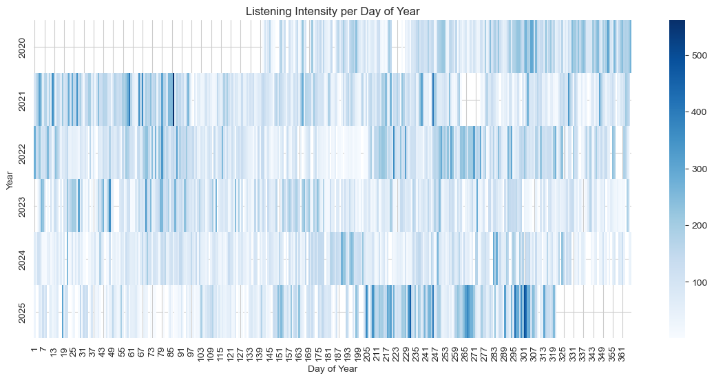
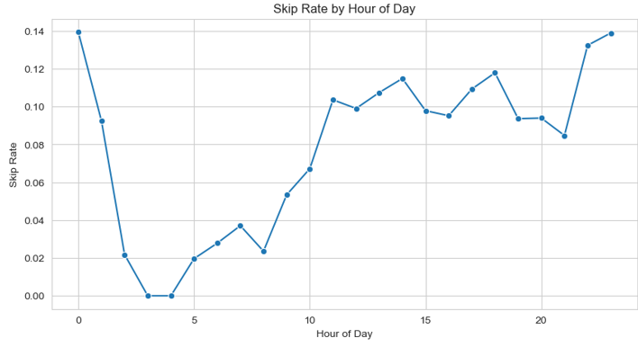
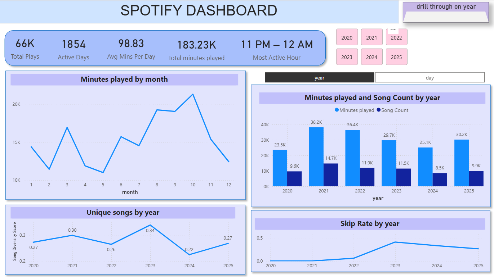
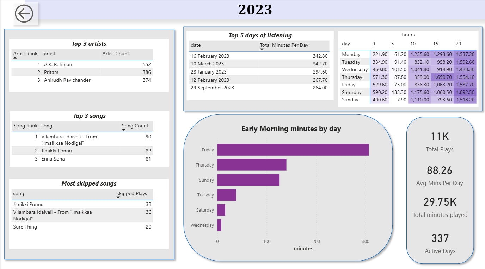

# 🎧 Spotify Listening Behavior Analysis (2020–2025)

## 📌 Business Objective
Analyze Spotify streaming history to understand listening behavior, intensity, and preferences across time, enabling data-driven insights into user engagement patterns.

---

## 📂 Data Description
- **Source:** Spotify Extended Streaming History  
- **Format:** JSON  
- **Files:** Multiple yearly files (2020–2025)  
- **Granularity:** Track-level listening events  

---

## 🛠 Tools & Skills Demonstrated
- Python (Pandas, NumPy, Matplotlib, Seaborn)
- Data Cleaning & Feature Engineering
- Exploratory Data Analysis (EDA)
- Time Series Analysis
- Clustering
- Power BI (Dashboarding & Drill-through)
- Data Storytelling

---

## 🧹 Data Preparation
Key data preparation steps performed in Python:
- Merged multiple JSON files into a unified dataset
- Removed duplicates and invalid records
- Filtered out null or missing track names
- Converted streaming time from milliseconds to minutes
- Removed non-analytical columns (country, IP address, audiobook metadata)
- Standardized platform values
- Engineered time-based features from timestamps:
  - Year, Month, Date
  - Hour
  - Weekday

---

## 📊 Analytical Approach
The analysis focused on understanding **when**, **how**, and **how much** listening occurs over time.

### ⏰ Time-Based Listening Patterns
- Hourly listening trends
- Early-morning listening behavior
- Weekday vs weekend comparisons
- Listening intensity by month and year

### 🎧 Behavioral Analysis
- Listening streak detection (≥ 240 minutes per day)
- Skip rate analysis by hour and year
- Song diversity score based on unique tracks played

### 📈 Advanced Analysis
- Heatmaps:
  - Hour × Weekday
  - Year × Weekday
- Monthly clustering into:
  - Heavy
  - Medium
  - Light listening periods

---

## 📸 Python Analysis Highlights

### ⏰ Hour × Weekday Listening Heatmap

### ⏭ Skip Rate by Hour

---

## 📈 Power BI Dashboard
The dashboard enables interactive exploration using slicers and drill-through functionality.

### ▪ Overview Dashboard

### ▪ Year-wise Drill-through

---

## 🔍 Key Insights
- Peak listening occurs late at night (11 PM – 12 AM)
- Weekends consistently show higher listening intensity
- A small subset of artists contributes to a large portion of total listening time
- Song diversity peaked in 2023 before declining slightly
- Skip rates increased during high-intensity listening periods

---

## 📑 Detailed Case Study
A step-by-step walkthrough of the analysis, methodology, and insights is available here:

👉 [Spotify Analysis – Case Study (PDF)](presentation/spotify_analysis.pdf)

---

## 🧠 Reflection
Working on this project helped me strengthen my skills in time-based analysis, feature engineering, and translating raw usage data into meaningful behavioral insights. It also improved my ability to present technical findings through clear visual storytelling.

---

## 🚀 Future Enhancements
- Automate data ingestion for future years
- Add artist-level and genre-level analysis
- Build a refreshable Power BI pipeline
